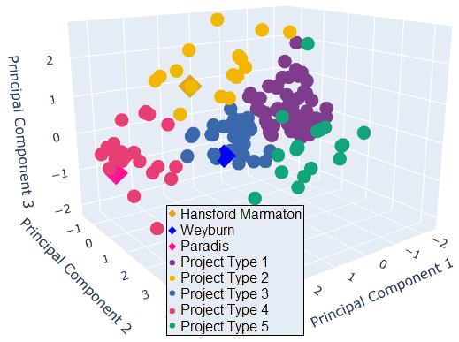

# Where Do You Belong?
### Clustering Algorithms for CO2 Flooding Project Segmentation

## Objective
Applied unsupervised learning techniques to organize global CO2 flooding projects into clusters. Those clusters were used to identify projects that share a similar set of reservoir and fluid parameters. Characteristics and performances of these analogous projects can be used to identify processes and decisions applicable to all. This will enhance operational and technical planning decisions in new or current CO2 flooding projects at field and well levels .

## The Dataset
The dataset is collated from extensive review and examination of successful pilot/field CO2 flooding projects that were published in Oil and Gas Journal biannual EOR surveys (from 1980 to 2014), SPE publications, DOE reports, and AAPG databases.

It is a multivariate dataset with 170 rows of data and 12 features.Each row describes a CO2 Flooding project, and each column describes an attribute of the project. The twelve features are field , reservoir and fluid parameters which are selected and extracted because they are commonly available and used for EOR project data analysis.

The information will be used to categorize global CO2 flooding projects into clusters of similar characteristics that can be referenced as benchmark or analogues for future projects.

## Key Skills Demonstrated
* Data cleaning
* Dimensionality reduction with PCA
* Unsupervised clustering
* Model comparison

## Publication
This is the code base for my published journal review paper 
> Olukoga, T. A., & Feng, Y. (2021). Determination of miscible CO2 flooding analogue projects with machine learning. Journal of Petroleum Science and Engineering, 109826.
https://doi.org/10.1016/j.petrol.2021.109826

## Result

